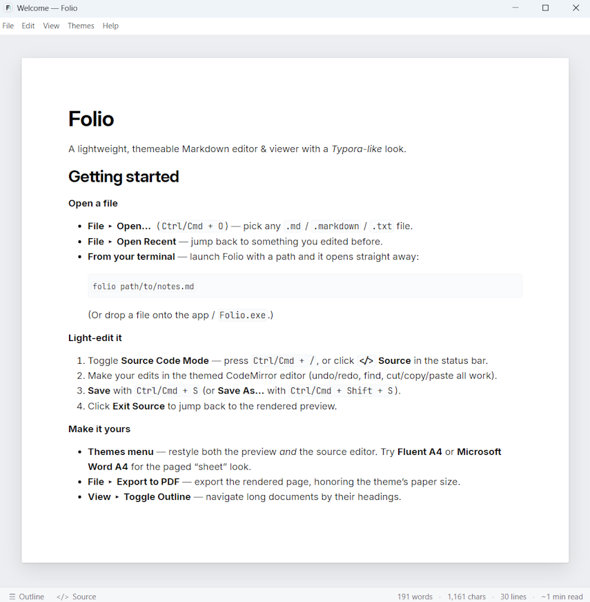

# Folio

**A lightweight, themeable Markdown editor & viewer with a Typora-like look, edit the
source, preview it rendered, swap CSS themes (Typora-theme compatible).**

Folio renders your Markdown into a paged, themed "sheet" (just like Typora), lets you flip
into a themed source-code editor, and switches the whole look, preview *and* editor, by
swapping a single CSS theme file.



---

## Why Folio?

I own a valid Typora license, but it's limited to 3 machines and I use many more, work and
home desktops, several laptops, and cloud/remote boxes. Folio lets me **view and lightly
edit** my Markdown with the same familiar, paged, themeable look on all those extra
machines. It's meant to **complement Typora, not replace it**: same theming conventions, so
the CSS themes I already use "just work."

## Non-affiliation disclaimer

> Folio is **not affiliated with, endorsed by, or sponsored by the Typora team**. "Typora"
> is a trademark of its respective owner and is referenced here solely to describe theme
> compatibility.

---

## Features

- **Rendered preview** of GitHub-flavored Markdown injected into Typora's `#write`
  container, so Typora themes style it as a page/sheet.
- **Themed source-code editor** (CodeMirror 6) under `#typora-source`, so a selected theme
  styles the editor too, including the grey-bar-free source-mode background.
- **Typora-compatible theming** on three independent axes, **Style** (Fluent, GitHub,
  Microsoft Word), **Appearance** (Light, Dark) and **Page width** (Dynamic, A4, US Letter),
  chosen from the **Themes** menu and remembered between launches.
- **Live features** via [markdown-it](https://github.com/markdown-it/markdown-it): tables,
  strikethrough, task lists, footnotes, autolinking, typographic replacements, and emoji.
- **Syntax highlighting** of fenced code blocks with
  [highlight.js](https://highlightjs.org/).
- **Math typesetting** with [KaTeX](https://katex.org/): inline `$…$` and display `$$…$$`
  TeX formulas, rendered in the preview and included in PDF exports.
- **Document outline** sidebar generated from headings.
- **Folder mode / file explorer**, `File > Open Folder…` shows a browsable tree of the
  Markdown files in a directory. Click a file to render it; click a link between documents
  to follow it in place (a folder link opens the folder's `_index.md`). The explorer stays
  in sync with whatever's rendered, and unsaved changes are guarded before navigating.
- **Back / forward navigation**, `Go > Back` (`Alt+Left`, or `Cmd+[` on macOS) and
  `Go > Forward` (`Alt+Right`, or `Cmd+]`) walk your document history like a browser after
  following links between files.
- **Status bar** (Typora-style) with mode-toggle buttons (Files, Outline, Source/Exit Source)
  and live document stats: word, character and line counts plus an estimated reading time.
- **File handling**: Open, Open Folder, Open Recent, Save, Save As, and **Export to PDF** (via
  Electron's `printToPDF`, honoring the A4 / US Letter page themes).
- **Unsaved-changes tracking** with a title-bar indicator and a save prompt on open/close.
- **Zoom** in/out/reset, and **cross-platform** (macOS, Linux, Windows).

## How it works, the theming contract

Folio deliberately mirrors Typora's DOM so existing themes render faithfully:

- Rendered Markdown is injected inside an element with **`id="write"`** (themes style
  `#write` as the page).
- The source editor lives under **`#typora-source`** using CodeMirror 6, with a legacy
  `.CodeMirror` compatibility class so `#typora-source .CodeMirror*` theme rules apply.
- The body gets the class **`typora-sourceview-on`** in source mode (themes key the white
  source-mode background off this).
- Themes are composed from a small stack of stylesheets (base foundation → style overlay →
  page-width overlay) swapped via `<link href>`; `@import` chains, `@font-face`, and
  window-width `@media` breakpoints all work because the renderer is Chromium. **Dark mode**
  is applied by flipping Chromium's `prefers-color-scheme` (through Electron's `nativeTheme`),
  which activates the dark palettes the theme stylesheets carry.

---

## How to build & run

**Prerequisites:** [Node.js LTS](https://nodejs.org/) (Node 18+; developed on Node 20/24).
Very new, non-LTS Node releases (26+) can trip up Electron's installer, see
[If Electron fails to install correctly](#if-electron-fails-to-install-correctly) below.

```sh
# 1. Install dependencies
npm install

# 2. Run the app (builds the renderer bundle, then launches Electron)
npm start
```

`npm start` bundles the renderer with [esbuild](https://esbuild.github.io/) and launches
Electron. On first launch it opens a bundled `samples/welcome.md` demo document.

#### If Electron fails to install correctly

On some **bleeding-edge Node.js releases** (e.g. Node 26+), Electron's own
`postinstall` step silently fails to unpack its runtime, the per-platform binary
downloads and is cached, but the bundled `extract-zip` extractor no-ops, leaving
`node_modules/electron` with no `path.txt` and an empty `dist/`. Running the app
then throws:

```
Error: Electron failed to install correctly, please delete node_modules/electron
and try installing again
```

Folio self-heals this automatically. A small helper, `scripts/ensure-electron.js`,
runs on `postinstall` and again before `npm start` / `npm run dist*`. If Electron's
binary is missing it locates the cached download (fetching it via Electron's own
installer if needed) and extracts it with the platform's **native** unzip tool
(`ditto` on macOS, `unzip` on Linux, `Expand-Archive` on Windows), then writes
`path.txt`. When Electron is already installed correctly it's a no-op, so it's safe
on every platform. You can also run it directly:

```sh
npm run ensure:electron
```

> The most robust fix is still to use an **Electron-supported Node.js LTS**
> (Node 18/20/22), where Electron's normal installer works and the helper simply
> no-ops.

### Packaging

Folio packages with [electron-builder](https://www.electron.build/):

```sh
npm run dist          # package for the current platform
npm run dist:win      # Windows (NSIS installer)
npm run dist:mac      # macOS (DMG)
npm run dist:linux    # Linux (AppImage + deb)
```

Build artifacts are written to `release/`.

#### Linux packaging prerequisites

On Linux, packaging the `.deb` and running the resulting `.AppImage` need a few
system libraries that aren't always installed by default:

- **`libcrypt.so.1`**, electron-builder's bundled [`fpm`](https://fpm.readthedocs.io/)
  tool (used to build the `.deb`) links against the legacy `libcrypt.so.1`.
  Without it, `npm run dist` fails with
  *`ruby: error while loading shared libraries: libcrypt.so.1`*.
- **`libfuse.so.2`**, AppImages need FUSE 2 to self-mount and run. Without it,
  running the built AppImage prints *`AppImages require FUSE to run`*.

Install them with your distribution's package manager:

```sh
# Fedora / RHEL
sudo dnf install libxcrypt-compat fuse fuse-libs

# Debian / Ubuntu
sudo apt install libxcrypt1 libfuse2
```

If you only want the `.AppImage` and not the `.deb`, you can skip the build with
`electron-builder --linux AppImage` (which needs neither of the above to build,
only `libfuse.so.2` to *run* the result).


#### App icon

The app icon lives in `build/icons/` as an editable `icon.svg` (a light rounded
tile with a stylized **F** and a teal editor caret). The packaged `.ico`
(Windows), `.icns` (macOS), and `.png` (Linux) files are generated from it with:

```sh
npm run icons
```

(Requires the dev-only `sharp` and `png2icons` packages, installed by
`npm install`.) The generated files are committed, so this only needs re-running
when the SVG changes.

#### Windows packaging note

electron-builder downloads a `winCodeSign` bundle that contains macOS symlinks.
Extracting those symlinks on Windows normally requires Administrator rights or
**Developer Mode**, and without them the build fails with *"Cannot create
symbolic link : A required privilege is not held by the client."* This is an
electron-builder/Windows limitation, not a Folio bug.

Folio works around it automatically: `npm run dist` / `npm run dist:win` first
run `scripts/prepare-wincodesign.js`, which pre-extracts that bundle with
symlink creation disabled into electron-builder's cache, so no Administrator
rights or Developer Mode are needed. (The macOS symlinks are irrelevant to a
Windows build.)

#### Windows "Unable to commit changes" (rcedit) note

On Windows, electron-builder stamps version info and the icon into the freshly
built `Folio.exe` with `rcedit`. That step can fail with:

```
⨯ cannot execute  cause=exit status 1
  errorOut=Fatal error: Unable to commit changes  (rcedit-x64.exe …)
```

This is a **file lock**, not a Folio bug, usually antivirus (Windows Defender)
scanning the ~180 MB executable the instant it's written, or a previously
packaged **Folio still running** and holding `release\win-unpacked\Folio.exe`
open. Folio mitigates it automatically:

- `npm run dist` first runs `scripts/clean-release.js`, which deletes the stale
  `*-unpacked` output. If it can't (because a packaged Folio is open) it stops
  with a clear message instead of the cryptic rcedit error, just close Folio
  and re-run.
- Packaging then runs through `scripts/run-electron-builder.js`, which retries
  automatically when it detects the transient rcedit lock (and fails fast on any
  other error).

If it still fails after the retries, close any running Folio and/or add the
project's `release\` folder to your antivirus exclusions, then run the command
again.

---

## How to use

- **Open a file**, `File > Open…` (`Ctrl/Cmd+O`). Recently opened files appear under
  `File > Open Recent`.
- **Open from the command line**, launch Folio with a file path and it opens that document
  on startup (or focuses the running window and opens it):

  ```sh
  # from a dev checkout
  npm start -- path/to/notes.md
  
  # or a packaged build
  Folio path/to/notes.md
  ```

  You can also drop a file onto the app (or `Folio.exe`), or double-click a file associated
  with Folio. When launched with no file, Folio shows the welcome document.

  **The `folio` command on macOS**, a packaged macOS build installs as
  `/Applications/Folio.app`, and a `.app` bundle is a folder rather than a plain
  executable, so it isn't on your `PATH` by default (on Windows the installer already
  puts `Folio` on `PATH`). To get a `folio` command in your terminal, use
  `File > Install 'folio' Command in PATH…`. This writes a small wrapper to
  `/usr/local/bin/folio`, after which you can run:

  ```sh
  folio path/to/notes.md
  ```

  You may need to open a new terminal (and have `/usr/local/bin` on your `PATH`). If the
  menu command reports it needs elevated permissions, it shows a copy-paste one-liner you
  can run yourself:

  ```sh
  sudo mkdir -p /usr/local/bin && printf '#!/bin/sh\nexec open -a "Folio" "$@"\n' | sudo tee /usr/local/bin/folio >/dev/null && sudo chmod 0755 /usr/local/bin/folio
  ```

  With no setup at all, `open -a Folio path/to/notes.md` launches an installed Folio and
  opens the file.

  **The `folio` command on Linux**, a packaged Linux build ships as an AppImage, which is a
  single executable file that isn't on your `PATH` on its own. Launch Folio from the
  AppImage and use `File > Install 'folio' Command in PATH…` to symlink it into
  `~/.local/bin/folio`, after which you can run:

  ```sh
  folio path/to/notes.md
  ```

  Unlike macOS this needs no `sudo` — `~/.local/bin` is your own directory and is on `PATH`
  by default on most modern distributions. If the menu item is greyed out or missing, Folio
  wasn't launched from an AppImage (the `APPIMAGE` environment variable isn't set): a `.deb`
  install already puts `folio` on your `PATH`, so there's nothing to do. Otherwise you can
  create the symlink yourself:

  ```sh
  mkdir -p ~/.local/bin && ln -sf /path/to/Folio.AppImage ~/.local/bin/folio
  ```

  You may need to open a new terminal (and have `~/.local/bin` on your `PATH`).

  The wrapper works from any shell that has `/usr/local/bin` on its `PATH`, normally both
  `zsh` and `bash`, and `pwsh` too when it's launched from your terminal. If you run
  PowerShell as a *login* shell and `folio` isn't found, `/usr/local/bin` simply isn't on
  its `PATH` (the same one-time setup pwsh needs for Homebrew and other CLI tools). Add this
  line to your PowerShell **profile file** so it runs on every startup, open it with
  `pwsh -c 'code $PROFILE'` (or edit `~/.config/powershell/Microsoft.PowerShell_profile.ps1`)
  and add:

  ```powershell
  $env:PATH += ':/usr/local/bin'
  ```

  Then open a new PowerShell window (or run `. $PROFILE`) and check with `Get-Command folio`.
  Note: typing that line at the `pwsh` prompt only changes the current session and is lost
  when you close it, it has to live in the profile file to persist. This is PowerShell
  syntax for the PowerShell profile; `zsh`/`bash` need nothing extra.
- **Open a folder**, `File > Open Folder…` (`Ctrl/Cmd+Shift+O`) opens a **file explorer**
  down the left side listing the Markdown files in that directory tree. Click a file to render
  it; the explorer highlights whatever's showing. Clicking a link from one document to another
  follows it in place, and a link that points at a folder opens that folder's `_index.md`
  (falling back to `README.md`). If the current document has unsaved edits you're prompted to
  save or discard first. Toggle the explorer with `View > Toggle File Explorer`
  (`Ctrl/Cmd+Alt+E`) or the **Files** button in the status bar; the last opened folder is
  remembered between launches. Close the folder with `File > Close Folder` (`Ctrl/Cmd+Shift+W`),
  which hides the explorer and returns to the Welcome document.
- **Go back / forward**, `Go > Back` (`Alt+Left`, `Cmd+[` on macOS) and `Go > Forward`
  (`Alt+Right`, `Cmd+]`) retrace the documents you've viewed after following links between
  files, like a browser. Unsaved edits are guarded before moving, and the file explorer keeps
  its selection in sync.
- **Toggle source mode**, `View > Toggle Source Code Mode` (`Ctrl/Cmd+/`), or the
  **`</>` Source** button in the status bar. The themed CodeMirror editor appears; toggle
  back (the button reads **Exit Source**) to re-render the preview.
- **Line numbers**, `View > Show Line Numbers` toggles an optional gutter of line numbers in
  the source editor. The choice is remembered between launches (off by default).
- **Format**, the **Format** menu (and keyboard shortcuts) apply Markdown formatting in
  **source mode**. With text selected the marks wrap the selection; with nothing selected
  the marks are inserted with the caret between them. Pressing the same shortcut on already
  formatted text (or a heading of the same level) toggles it back off.
  - **Bold** `Ctrl/Cmd+B` · **Italic** `Ctrl/Cmd+I` · **Underline** `Ctrl/Cmd+U`
    (inserts `<u>…</u>`) · **Strikethrough** `Ctrl/Cmd+Shift+X` · **Inline Code** `Ctrl/Cmd+E`
    · **Code Block** `Ctrl/Cmd+Shift+E` · **Link** `Ctrl/Cmd+K`.
  - **Inline Math** `Ctrl/Cmd+M` (wraps in `$…$`) · **Math Block** `Ctrl/Cmd+Shift+M`
    (wraps in `$$…$$`). Math is rendered with [KaTeX](https://katex.org/) — write TeX between
    `$…$` for inline formulas or `$$…$$` for display equations.
  - **Headings** `Ctrl/Cmd+1` … `Ctrl/Cmd+6` set the current line(s) to that heading level.
- **Switch themes**, the **Themes** menu offers three independent choices: a **Style**
  (Fluent, GitHub, Microsoft Word), an **Appearance** (Light, Dark) and a **Page width**
  (Dynamic, A4, US Letter). Both the preview and the source editor restyle instantly; your
  selection is remembered.
- **Outline**, `View > Toggle Outline` (`Ctrl/Cmd+Alt+O`), or the **Outline** button in
  the status bar, shows a headings sidebar.
- **Save**, `Ctrl/Cmd+S` (Save As: `Ctrl/Cmd+Shift+S`). An unsaved document shows a `•` in
  the title bar and prompts before you close or open another file.
- **Copy file path**, `File > Copy File Path` (`Ctrl/Cmd+Shift+C`) copies the open document's
  full path to the clipboard (handy for sharing or pasting into a terminal). A short toast
  confirms the copy.
- **Export to PDF**, `File > Export to PDF…`. The page size follows the active **Page width**
  (A4 vs US Letter).
- **Zoom**, `Ctrl/Cmd +` / `Ctrl/Cmd -` / `Ctrl/Cmd 0`.
- **Find**, `Ctrl/Cmd+F` searches the current document: a find bar appears over the rendered
  preview (highlighting every match, with next/previous), and in source mode it opens
  CodeMirror's search panel.
- **Find in Files**, `Ctrl/Cmd+Shift+F` (needs an open folder) searches every Markdown file in
  the folder. A search box appears at the top of the file-explorer pane; results are grouped by
  file, and clicking a match opens that document with the term highlighted. Press `Esc` (or clear
  the box) to dismiss the search and return to the file tree.

---

## Themes

The **Themes** menu is organised as three independent, one-of choices that combine into the
active look:

| Axis           | Options                              | What it controls                                   |
| -------------- | ----------------------------------- | -------------------------------------------------- |
| **Style**      | Fluent · GitHub · Microsoft Word    | Fonts, colours and heading treatment               |
| **Appearance** | Light · Dark                        | Light or dark palette (whole app, including chrome) |
| **Page width** | Dynamic · A4 · US Letter            | The writing column: window-filling or a fixed sheet |

That's 3 × 2 × 3 = 18 combinations from a handful of small stylesheets, rather than 18
separate theme files. Your selection is remembered between launches.

**How it's composed.** Folio ships a `themes/` folder laid out symmetrically — a shared
`base.css` foundation plus one folder per **Style** family, each holding its family overlay
(if any) and its three **Page-width** overlays. A look is built at runtime by layering these
as `<link class="folio-theme">` elements (later layers win):

```
themes/
  base.css                     shared foundation (also the Fluent palette)
  fluent/  dynamic.css  a4.css  us-letter.css
  github/  github.css  dynamic.css  a4.css  us-letter.css
  word/    word.css    dynamic.css  a4.css  us-letter.css  fonts/
```

| Selection | Layers loaded (in order) |
| --------- | ------------------------ |
| Fluent    | `base.css` → `fluent/<width>.css` |
| GitHub    | `base.css` → `github/github.css` → `github/<width>.css` |
| Word      | `base.css` → `word/word.css` → `word/<width>.css` |

Fluent needs no family overlay because `base.css` already carries the Fluent palette; GitHub
and Word add a thin overlay that overrides the palette and typography.

**Appearance** is not a file swap: Folio flips Chromium's `prefers-color-scheme` via
Electron's `nativeTheme`, so every layer's `@media (prefers-color-scheme: dark)` block (and
Folio's own chrome + syntax colours) switches to its dark palette together.

### Add your own Typora themes

Folio honors the Typora DOM contract (`#write`, `#typora-source .CodeMirror`,
`typora-sourceview-on`), so most Typora themes work unchanged. To add one as a new **Style**,
create a `themes/<family>/` folder with the theme's `.css` (and any asset subfolder), then
register it in `src/main.js` (`familyLayers` / the `STYLE_FAMILIES` list) and add a radio
entry in `src/menu.js`. A self-contained Typora theme can be used as its own base — just
return `['<family>/<family>.css']` from `familyLayers` and supply matching `<width>.css`
overlays (or reuse Fluent's). Giving the theme `@media (prefers-color-scheme: dark)` variables
makes it Dark-aware automatically.

### ⚠️ A note about the Aptos fonts (Microsoft Word themes)

The Microsoft Word themes reference **Aptos** fonts. The `.ttf` files are **Microsoft Office
"cloud fonts"** and are **not redistributed** in this repository, they're excluded via
`.gitignore` (`themes/word/fonts/*.ttf`).

To get the full Word look, supply your own Aptos fonts by copying these files into
`themes/word/fonts/`:

```
Aptos-Regular.ttf        Aptos-Bold.ttf
Aptos-Italic.ttf         Aptos-BoldItalic.ttf
AptosDisplay-Regular.ttf AptosDisplay-Bold.ttf
```

On Windows with Office installed they typically live under
`C:\Users\<you>\AppData\Local\Microsoft\FontCache\4\CloudFonts\Aptos\`. Without them, the
Word themes fall back to **Segoe UI / Inter**.

> The **Fluent** themes look best with the free [Inter](https://github.com/rsms/inter) and
> [JetBrains Mono](https://www.jetbrains.com/lp/mono/) fonts installed, but degrade
> gracefully to system fonts.

---

## Project layout

```
src/
  main.js        Electron main process (window, menus, IPC, file I/O, PDF export)
  preload.js     contextBridge IPC surface
  menu.js        native application menu template
  folder.js      folder-mode helpers: explorer tree scan + link/nav resolution
  store.js       settings persistence (JSON in userData)
  renderer/
    index.html   #write (preview) + #typora-source (editor) + file explorer shells
    renderer.js  markdown-it render + CodeMirror 6 + theme swapping (bundled by esbuild)
    app.css      app chrome + CodeMirror→Typora compat + highlight.js token colors
themes/          Typora-compatible themes: base.css + per-family folders (fluent/ github/ word/)
samples/         welcome.md demo document
build.js         esbuild bundler for the renderer
```

## License

[MIT](LICENSE) © David Pokluda.

## Acknowledgements

- **Typora**, for the theming conventions (`#write`, `#typora-source`,
  `typora-sourceview-on`) this app deliberately mirrors for compatibility.
- **[Electron](https://www.electronjs.org/)**, cross-platform Chromium shell.
- **[CodeMirror 6](https://codemirror.net/)**, the source-code editor.
- **[markdown-it](https://github.com/markdown-it/markdown-it)** and its plugins, Markdown
  rendering.
- **[highlight.js](https://highlightjs.org/)**, fenced-code syntax highlighting.
- **[KaTeX](https://katex.org/)**, math typesetting (via
  [@vscode/markdown-it-katex](https://github.com/microsoft/vscode-markdown-it-katex)).
- The **[Fluent](https://github.com/li3zhen1/Fluent-Typora)** theme, on which the bundled
  Fluent variants are based.
